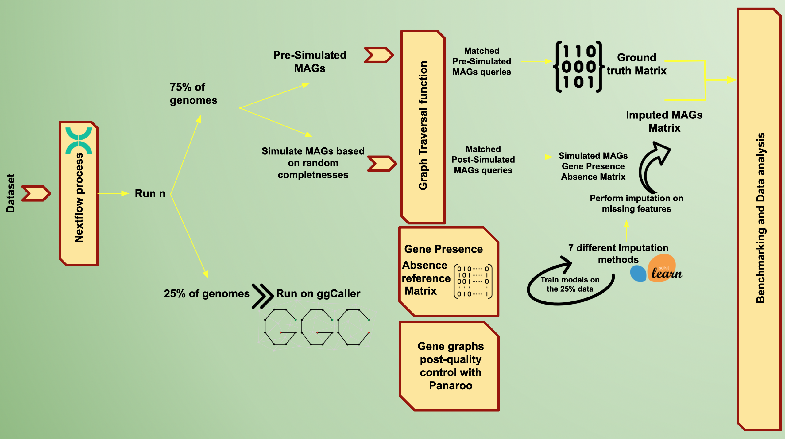

# MAGGImpute
 A Metagenome annotation workflow with the graph based annotation tool, ggcaller.

When constructing pangenomes from metagenomic data, researchers aim to obtain a comprehensive overview of all genes present in a microbial community, encompassing both core and accessory genes. This involves two primary methods: assembling reads into contigs to create complete and precise MAGs for mapping predicted genes onto known sequences, or directly aligning individual reads with known gene sequences [see reference](https://www.ncbi.nlm.nih.gov/books/NBK558825/). This approach is critical as it provides deeper insights into microbial diversity, ecology, and potential applications [see reference](https://www.ncbi.nlm.nih.gov/pmc/articles/PMC1185649/). However, the use of MAGs introduces significant challenges, primarily due to their inherent incompleteness, contamination, and fragmentation [see reference](https://www.nature.com/articles/s43705-023-00221-z).

Incomplete assemblies might fail to capture the full array of core and accessory genes, which are vital for understanding microbial adaptability and niche specialization [See reference](https://pubmed.ncbi.nlm.nih.gov/16172379/). Missing these genes can lead to an incomplete picture of microbial diversity and function. Tools like [CheckM](https://github.com/Ecogenomics/CheckM) quantify the completeness of MAGs by evaluating the presence of a set of universal single-copy genes, providing an estimate of both the completeness and contamination levels of a genome. This gives an idea of how 'good' the assemblies are, indicating whether the full pangenome diversity from a set of MAGs is being captured. Contamination occurs when sequences from different organisms are incorrectly assembled together, misrepresenting the genetic makeup of the microbial community. CheckM also quantifies contamination by identifying sequences that deviate from the expected genomic properties of the target genome. Reducing contamination is essential for accurate functional annotation and downstream analysis.

Fragmentation refers to the incomplete assembly of genomes into contiguous sequences, resulting in a fragmented genomic landscape. Fragmented assemblies hinder the ability to link genes with their functional contexts, complicating the interpretation of metabolic pathways and ecological interactions [see reference](https://www.nature.com/articles/s43705-023-00221-z). Advances in assembly algorithms and tools aim to reduce fragmentation and improve the contiguity of MAGs. Tools like [PPanGGOLiN](https://www.ncbi.nlm.nih.gov/pmc/articles/PMC7108747/) and [mOTUpan](https://pubmed.ncbi.nlm.nih.gov/35979445/) refine the quality of MAGs by estimating a likely threshold for core genes, even in the presence of missing data. These tools lower the frequency threshold for core gene identification, helping to identify which genes are considered essential across multiple genomes. However, these tools do not provide information on which specific genomes the genes are missing from. [CELEBRIMBOR](https://github.com/bacpop/CELEBRIMBOR) (Core ELEment Bias Removal In Metagenome Binned ORthologs), co-developed by the Lees group at EMBL-EBI, enhances the accuracy of pangenomes constructed from metagenome data by identifying and correcting biases in core gene identification. This tool addresses some of the limitations of earlier methods by focusing on bias removal, but it still does not infer from which specific genomes genes are missing. MAGGIMPUTE represents an advancement over CELEBRIMBOR by providing more sophisticated methods for imputing missing genes in MAGs, thereby improving the completeness and reliability of pangenomic analyses. This workflow leverages advanced statistical techniques to predict missing gene content, offering a comprehensive view of the microbial community's genetic landscape. By addressing the issue of missing genes in specific genomes, MAGgIMPUTE enhances our understanding of the full pangenome diversity captured from a set of MAGs.

MAGGIMPUTE workflow begins with the dataset being processed by a Nextflow pipeline, which orchestrates the preprocessing and preparation of the genomic data by splitting the genomes and repeating the process for 10 runs. The dataset is then randomly divided into two subsets: 25% of the genomes are designated for training, and 75% for simulation. This division mimics real metagenome analysis, ensuring a robust basis for gene prediction while reflecting the complexity and variability of real-world metagenomic samples. The 25\% subset is processed using ggCaller for initial gene calling, generating gene graphs and a gene presence/absence matrix for the reference genomes. Next, a set of pre-simulated MAGs is prepared as a ground truth for benchmarking. MAGs are simulated based on varying levels of completeness, and the updated graph traversal function of ggCaller matches queries from both pre-simulated and post-simulated MAGs to the reference matrix, with a single k-mer overlap as the default threshold. Gene presence/absence matrices are generated for both the reference genomes and the simulated MAGs, capturing gene content across varying levels of completeness. Models are trained on the 25% subset of the original reference data to predict and impute missing gene presence/absence information, with seven different imputation methods applied to the simulated MAGs' gene presence/absence matrix. Finally, the imputed MAGs' matrix is compared against the ground truth matrix to assess the accuracy and effectiveness of the imputation methods, and the results are analyzed to determine the best approaches for handling incomplete MAG data.

---

